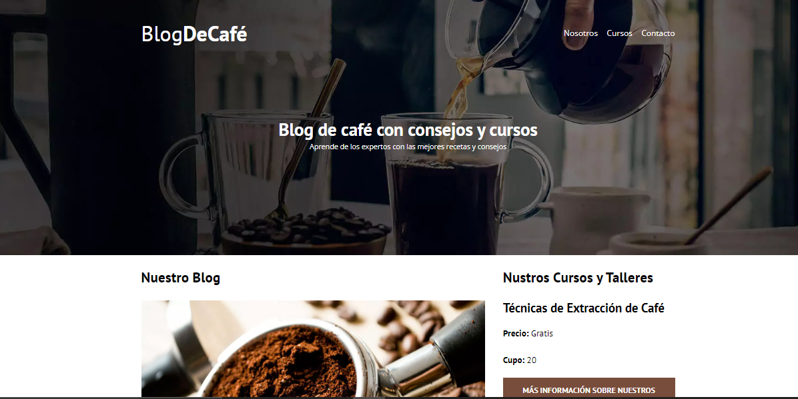
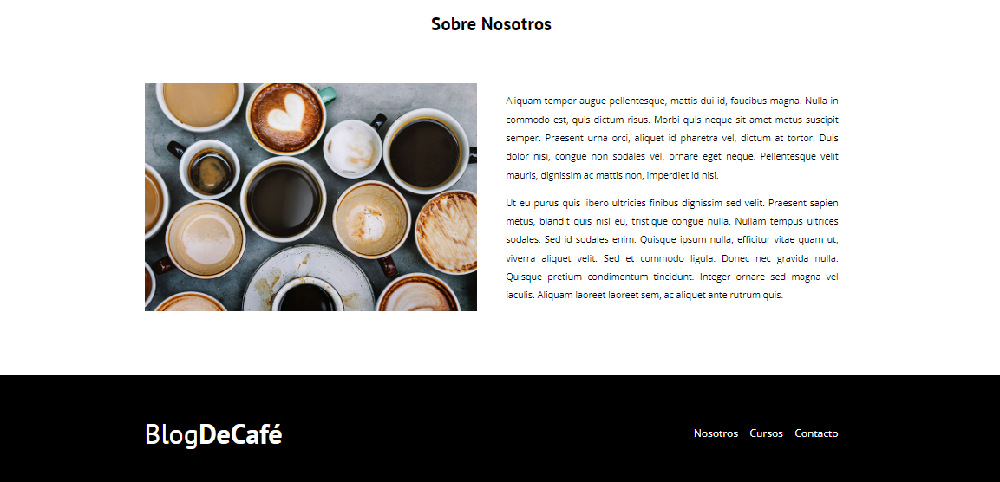
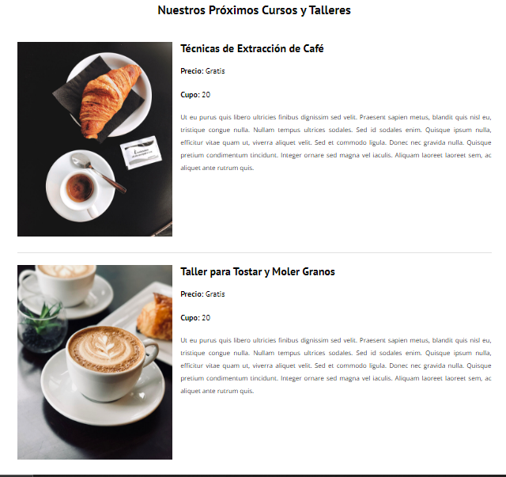

# Blog de Cafe

Blog de cafe es un sitio web pensado para un negocio en la venta de cafe, asi como de comida y/o cursos, el objetivo principal en el desarrollo de este proyecto fue el trabajar con mas de 1 vista, asi como poner aprueba mis conocimientos en el frontend, usando 2 tecnologias como base, HTML5 y CSS. De igual manera poder hacer un desarrollo y diseño mas moderno y adaptable a cualquier dispositivo. 

## Screenshots

## Tech Stack

**FrontEnd:** CSS, HTML5

